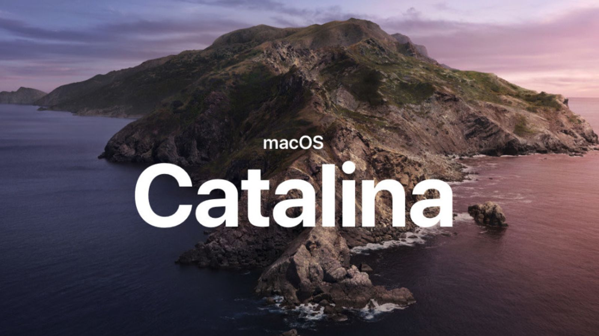

Apple has recently changed the requirements for applications to install on macOS 10.15 and above.



## Summary
Apple has recently changed the requirements for applications to install on macOS 10.15 and above. The change requires developers to notarize the application before it gets shipped. Notarization involves submitting the application to Apple to be scanned and generates a JSON report with any issues. More information about notarization can be found [here](https://developer.apple.com/documentation/security/notarizing_your_app_before_distribution).

## How does this affect my runtime?
There are a few different scenarios around today so let’s walk through them…

### You’ve never code signed your runtime before:
If you’ve always shipped your runtime without code signing it then you may not need to change anything, if a developer wishes to bundle your runtime into their application they can codesign at that stage and all will be well but…

### You ship macOS installers:
If you ship pkg or dmg installers then you are going to have to notarize the installer going forwards. In principle this means that you need to submit the installer to Apple using xcrun which comes with XCode:

```bash
xcrun altool --notarize-app --primary-bundle-id "<bundle id>" --username "<email>" --password "<password>" --file <installer>.pkg
```

Once this command has completed you will be given a **RequestUUID** which is what you then use to check the status:

```bash
xcrun altool --notarization-info <RequestUUID> --username "<email>" --password "<password>"
```

If all goes well then you will see `Status Message: Package Approved`. But unfortunately this won’t be enough for most users. (see codesigning instructions below)

### You codesign your runtime already:
If you already codesign your runtime then you will already be familiar with the following command:

```bash
codesign --timestamp --sign "Developer ID Application: <cert>" <binary to sign>
```

If you’ve tried to notarize your installer but you are seeing warnings about hardened runtime not being enabled you are going to have to modify your codesign command:

```bash
codesign --entitlements entitlements.plist --options runtime --timestamp --sign "Developer ID Application: <cert>" <binary to sign>
```

There are two key changes here:

1. Entitlements:
You must specify entitlements of your application, a typical set of entitlements may look like this:

```plist
<?xml version="1.0" encoding="UTF-8"?>
<!DOCTYPE plist PUBLIC "-//Apple//DTD PLIST 1.0//EN" "http://www.apple.com/DTDs/PropertyList-1.0.dtd">
<plist version="1.0">
<dict>
    <key>com.apple.security.cs.allow-jit</key>
    <true/>
    <key>com.apple.security.cs.allow-unsigned-executable-memory</key>
    <true/>
    <key>com.apple.security.cs.disable-library-validation</key>
    <true/>
    <key>com.apple.security.cs.allow-dyld-environment-variables</key>
    <true/>
    <key>com.apple.security.cs.debugger</key>
    <true/>
</dict>
</plist>
```

2. Runtime:
You must also now specify `--options runtime` in order to enable hardened runtime.


## Code has no resources but signature indicates that they are present?
Several people have rasied issues at AdoptOpenJDK about the following codesign error when they try to bundle our binary:

```bash
codesign --verify Contents/MacOS/libjli.dylib 
Contents/MacOS/libjli.dylib: code has no resources but signature indicates they must be present
```

The easiest way to fix this is to run the following commands:

```bash
xattr -cr <path to bundled app>
codesign --verbose=4 --deep --force -s "Developer ID Application: <cert>" <path to bundled app>
```

## Other Problems:
- Apple notarization requires the binary to have been compiled on xcode 9 or later. This may not be an issue for you but if you see warnings about algorithms being unsupported when you notarize you will need upgrade your compiler.
- Once you have notarized your installer, every user will be able to run it on their computers as long as they have an internet connection. In order to support users who do not have an internet connection you will need to staple the notarization report to the installer:

```bash
xcrun stapler staple "<installer.pkg>"
```