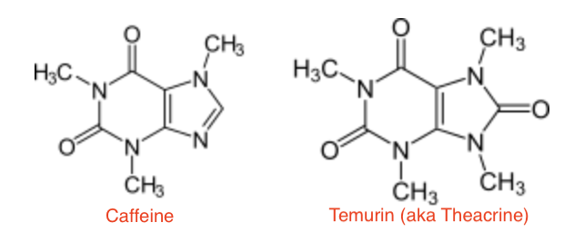

Six months ago, [we announced](/2020/06/adoptopenjdk-to-join-the-eclipse-foundation/) that AdoptOpenJDK is going to join the [Eclipse Foundation](https://www.eclipse.org) and rebrand as **Eclipse Adoptium**. After a long period of work behind the scenes, the first batch of project proposals is ready for community review. At the Eclipse Foundation, the monolithic AdoptOpenJDK project will be split into multiple sub-projects under the umbrella of the [Eclipse Adoptium Top Level Project](https://projects.eclipse.org/projects/adoptium):

* **Eclipse AQAvit** encompasses all our activities around testing, especially the development of our [AQA test suite](/2019/07/the-first-drop-introducing-adoptopenjdk-quality-assurance-aqa-v1-0/).
* **Eclipse Temurin** (an anagram of "runtime") focuses on building and releasing JDKs (that part that most folks associate with AdoptOpenJDK). Fun trivia fact is that Temurin is not only an anagram of "runtime" but is also a chemical compound, 1,3,7,9-tetramethyluric acid similar to caffeine with the bonus of being demonstratively non-habituating and clinically safe!

*Visualization of Caffeine and Theacrine (temurin) molecules (Source: [Wikipedia](https://commons.wikimedia.org/wiki/File:Caffeine_vs_Theacrine.png))* 

AdoptOpenJDK's application to become an Eclipse project was approved under the provision that we only release binaries that have passed the respective TCK. The [TCK for Java SE](https://openjdk.java.net/groups/conformance/JckAccess/) is a proprietary technology of Oracle and must be run confidentially. The Eclipse Foundation and AdoptOpenJDK went to great lengths to reconcile Oracle's requirements with the needs of the Adoptium community. The result is the [Eclipse Temurin Compliance](https://projects.eclipse.org/proposals/eclipse-temurin-compliance) project, which governs access to TCK material and resources. We thank Eclipse Foundation's Executive Director Mike Milinkovich and his team for reaching an agreement with Oracle and making this possible.

## Community Review

The [Community review](https://www.eclipse.org/projects/dev_process/#6_2_2_Proposal) is an important step towards the creation of the projects. We are looking for your feedback on those proposals to refine and enhance them. If you are already a member of the Eclipse Foundation, please communicate your feedback via the forms on the project pages linked below. Everyone else can [comment on our GitHub issue that collects feedback about our move to the Eclipse Foundation](https://github.com/AdoptOpenJDK/TSC/issues/160).

* [Eclipse AQAvit Project Proposal](https://projects.eclipse.org/proposals/eclipse-aqavit)
* [Eclipse Temurin Project Proposal](https://projects.eclipse.org/proposals/eclipse-temurin)
* [Eclipse Temurin Compliance Project Proposal](https://projects.eclipse.org/proposals/eclipse-temurin-compliance)

## The Road Ahead

After the community review has been successfully completed, the [incubation phase](https://www.eclipse.org/projects/dev_process/#6_2_3_Incubation) begins. The objective of the incubation phase is to set up the projects, processes, and infrastructure. Incubation ends with the first formal release.

We expect a first release of JDK binaries that have passed the respective TCK in H1 2021. It is very well possible that the first releases only include a subset of versions and platforms. We intend to migrate the remainder of versions and platforms until the end of 2021. In parallel, AdoptOpenJDK will continue to provide updates and new versions until the migration is complete. Afterwards, AdoptOpenJDK will be put into maintenance mode and stop releasing new binaries.
